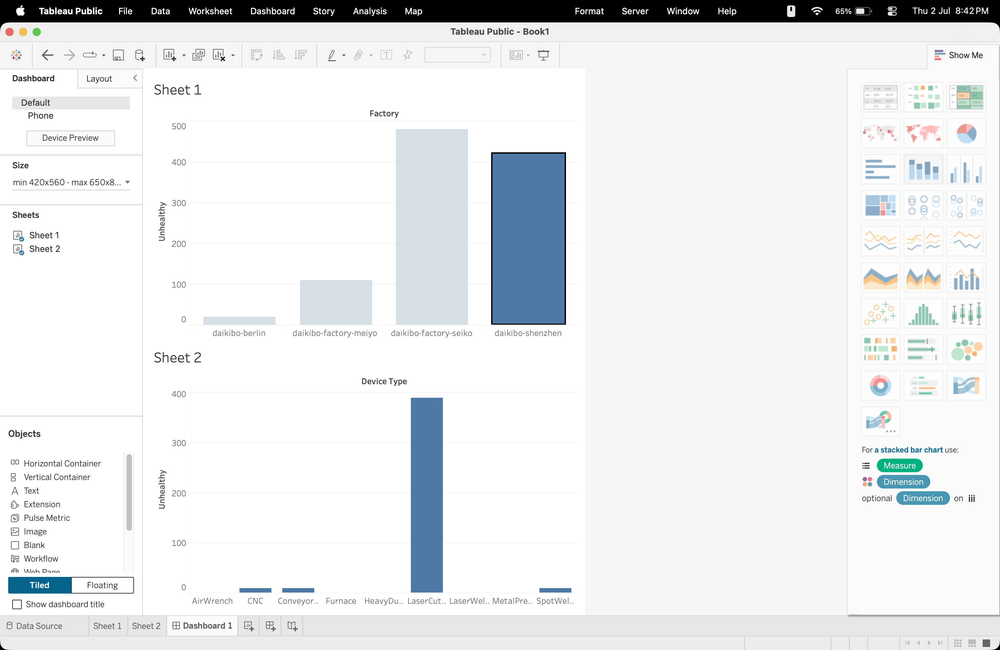
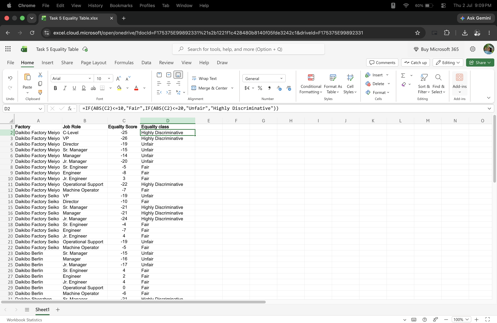
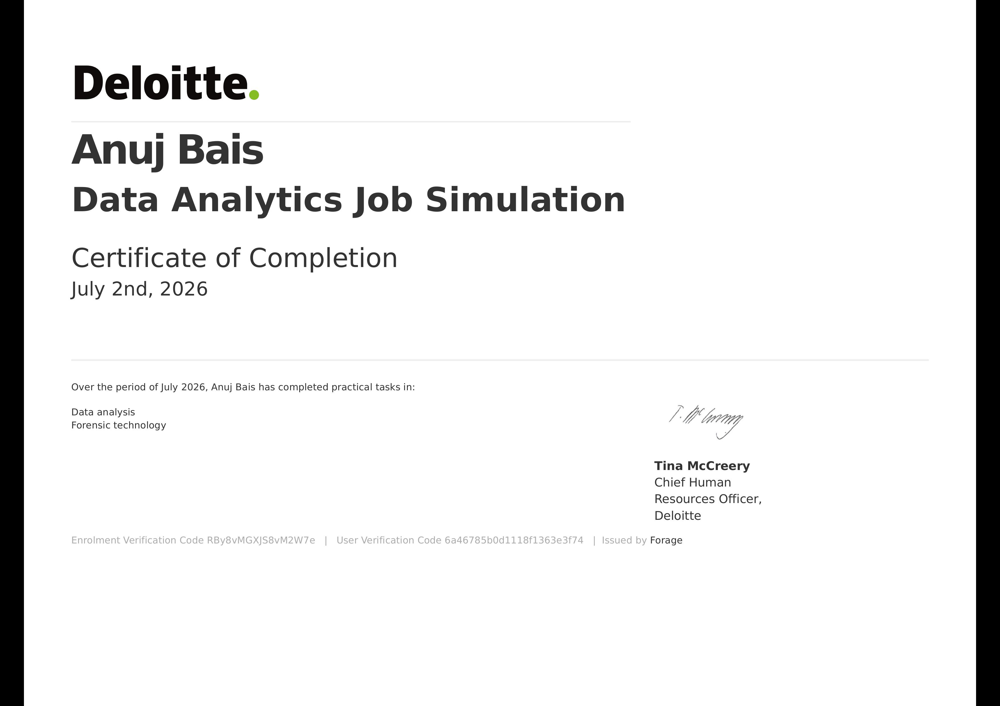

# Deloitte_Data_Analytics_Job_Simulation

> Practical Data Analytics Job Simulation completed through Forage in collaboration with Deloitte Australia.

## 📖 Overview

This repository contains my solutions for the **Deloitte Australia Data Analytics Job Simulation** offered by Forage.

During this simulation, I worked on real-world data analytics tasks involving data visualization, dashboard creation, and Excel-based data analysis to derive business insights.

---

## 🛠️ Tech Stack

- Tableau Public
- Microsoft Excel
- Data Analytics
- Business Intelligence

---

# 📂 Project Tasks

## Task 1 – Tableau Dashboard

### Objective
Analyze manufacturing data and build an interactive dashboard to identify unhealthy equality trends.

### Dashboard Includes
- Factory-wise unhealthy equality scores
- Device Type-wise unhealthy equality scores
- Interactive visualizations
- Business insights using charts

### Skills Used
- Data Visualization
- Dashboard Design
- Tableau
- Business Analytics

---

## Task 2 – Equality Score Classification (Excel)

### Objective
Classify employee equality scores into meaningful categories.

### Equality Classes

| Score Range | Class |
|-------------|-------|
| -10 to +10 | Fair |
| ±11 to ±20 | Unfair |
| More than ±20 | Highly Discriminative |

### Excel Formula

```excel
=IF(ABS(C2)<=10,"Fair",IF(ABS(C2)<=20,"Unfair","Highly Discriminative"))
```

### Skills Used

- Excel Functions
- Logical Formulas
- Data Classification
- Business Analysis

---

# 📊 Project Preview

## Tableau Dashboard



## Excel Classification



---

# 📈 Key Insights

- Built dashboards to visualize unhealthy equality scores.
- Compared factories based on equality metrics.
- Identified device types contributing to unhealthy scores.
- Classified equality scores into Fair, Unfair, and Highly Discriminative categories.
- Derived business conclusions using Tableau and Excel.

---

# 🏆 Skills Gained

- Tableau
- Dashboard Development
- Data Visualization
- Microsoft Excel
- IF Functions
- Business Analytics
- Data Analysis
- Problem Solving

---

# 📜 Certificate

Completed the **Deloitte Australia Data Analytics Job Simulation** on **Forage**, gaining practical experience in **Data Analysis** and **Forensic Technology**. :contentReference[oaicite:0]{index=0}



---

# 👨‍💻 Author

**Anuj Bais**

B.Tech Computer Engineering Student

- 💻 Software Development
- 📊 Data Analytics
- 📈 Business Intelligence

⭐ If you found this repository useful, consider giving it a star!
